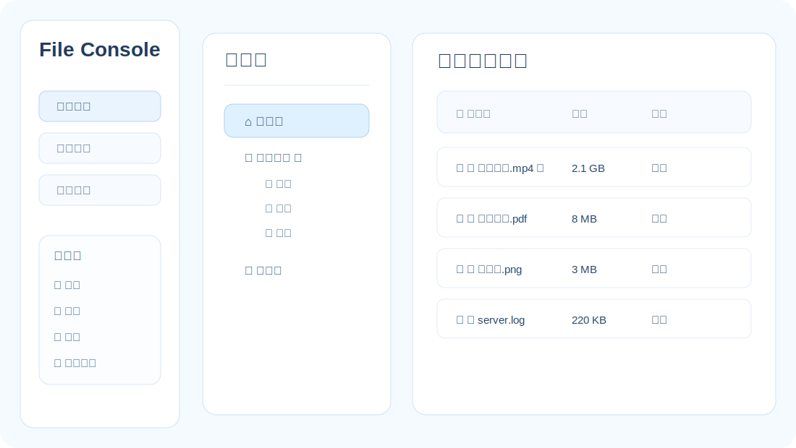
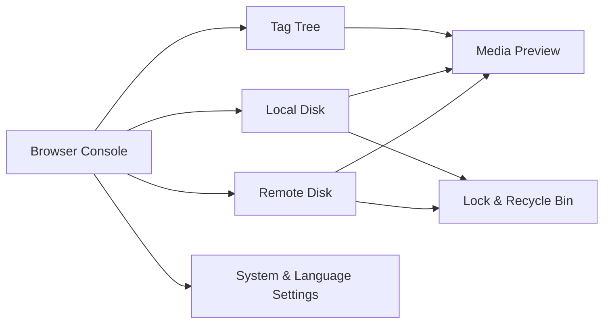
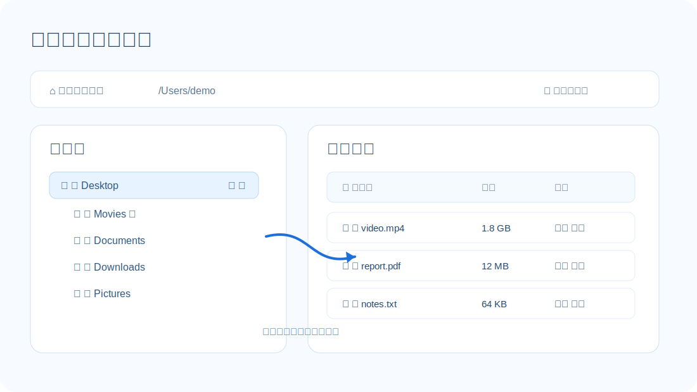
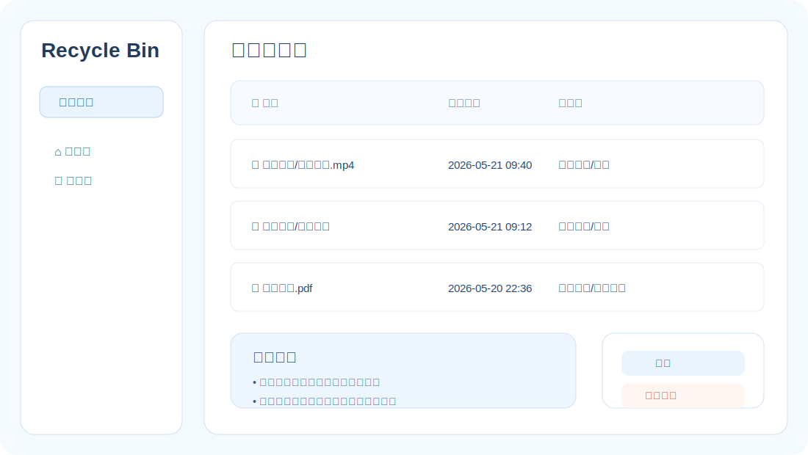
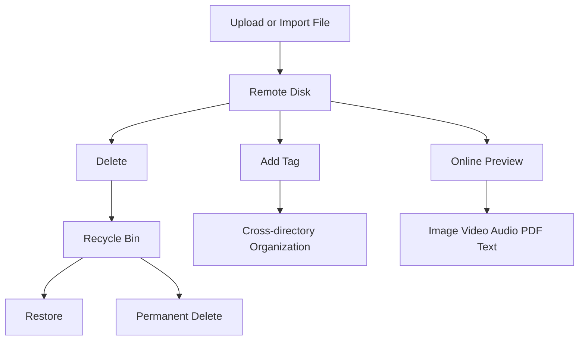
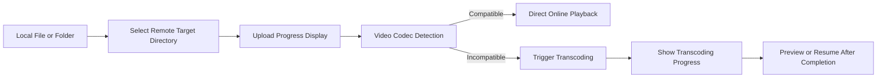
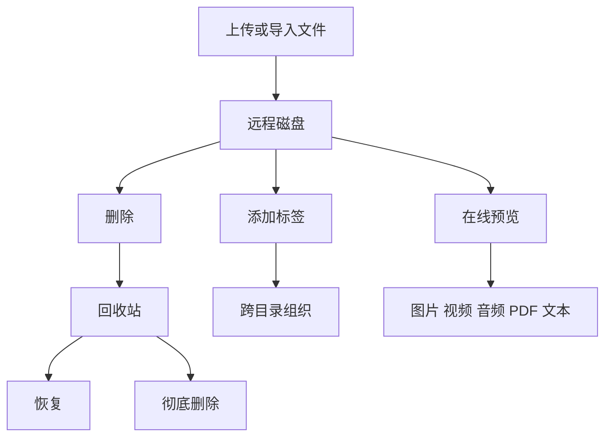
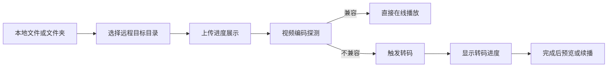

[English](#english) | [中文](#chinese)

<a name="english"></a>

# English
# webcool: A Versatile File Management Console for Personal and Private Environments

webcool is no longer just a simple file upload and download tool. It is more like a personal file console running in your browser: **it can manage remote storage, browse the server's local disk, handle regular documents, and smoothly preview images, videos, audio, PDFs, and text; it supports tag-based management, lock protection, recycle bin, batch operations, resume playback, transcoding, image editing, and system management.**

If you want to build a **lightweight yet fully functional** file management system on your own machine, home server, workstation, or private cloud, webcool offers a very practical set of capabilities.



## Quick Overview: What Can webcool Do

**You can think of webcool as a private file workspace that merges "file management, media preview, security protection, tag organization, and system configuration" into a single browser console.**

- **Remote Disk**: Manage your private file space after upload.
- **Local Disk**: Directly browse the server's local file system.
- **Tag Tree**: Organize files by topic, not just by directory.
- **Media Preview**: Images, videos, audio, PDFs, and text can all be opened directly.
- **Security Mechanisms**: Recycle bin, directory lock, file lock, and tag lock work together.
- **System Management**: Unified entry for storage path switching, language settings, and runtime configuration.



The above diagram shows the core structure of webcool: **Users operate remote files, local files, tag relationships, and media content through a unified interface, with security and system configuration capabilities running through the entire process.**

## 1. Remote Disk: Manage Private File Space Like Explorer

The remote disk is the core file management area of webcool. Users can view remote storage directories in the browser, create/rename/delete directories, restore items from the recycle bin, and perform operations such as **preview, download, delete, rename, tag, and lock** on files.


The remote disk supports a multi-level directory tree. The root directory and recycle bin are fixed entries. Regular directories can be right-clicked to create subdirectories, delete, rename, lock, unlock, and remove locks. Deleted directories do not disappear immediately but first enter the recycle bin, reducing the risk of accidental deletion. Files and folders in the recycle bin can be restored or permanently deleted.

The file list supports multiple interaction modes. **Clicking a file name selects it; clicking again on a selected file enters rename mode; double-clicking downloads the file.** This behavior avoids accidental downloads and makes renaming files more like a desktop file manager.

Each file also has a right-click menu for summary, download, rename, delete, or remove. The summary window shows file name, size, type, creation time, and modification time for quick information access.

---

## 2. Local Disk: Directly Browse the Server's Local File System

webcool not only manages remote upload directories but also supports browsing the server's local disk. After clicking "Local Disk," users can browse the local file system from the current user directory, root directory, parent directory, etc., and choose whether to display hidden files. **This means it is not only an upload panel but also a file browser on the server side.**



The local disk provides **list mode and split mode**. List mode is suitable for quickly viewing all files and directories in the current directory; split mode provides a directory tree and a file list on the right, suitable for moving files between deep directories, viewing content, and performing batch operations.

The local disk also supports sorting by name, type, size, and modification time. Directories display directory icons, and files show available actions based on their extensions, such as image preview, video playback, audio listening, text viewing, and PDF preview.

Files on the local disk also support single-click selection, click again to rename, and double-click to download. The right-click menu supports summary, download, rename, remove, lock, unlock, and remove lock; for local video files, you can also call the local player to play.

Local directories also support right-click operations, including rename, delete, lock, unlock, and remove lock. When a directory is deleted, it is moved to the system recycle bin instead of being deleted directly, reducing the risk of accidental loss.

## 3. Recycle Bin Mechanism: Extra Protection Before Deletion

webcool's deletion strategy emphasizes security. **Files and folders in the remote disk enter webcool's recycle bin after deletion; files and directories in the local disk are moved to the system recycle bin when deleted.**



In the remote disk recycle bin, users can restore files and folders or permanently delete them. For folders, webcool provides a dedicated restore entry and supports selecting and restoring or permanently deleting via the top button.

This design makes webcool more suitable for long-term storage and management of important files. **Users don't have to worry about irreversible loss due to a single misclick.**



This diagram shows the secure lifecycle of files in webcool: **After entering the remote disk, files can be organized, previewed, and deleted, but deletion does not mean immediate loss—they first enter a recoverable stage.**

## 4. Tag Tree: Organize Files Across Directories

Directories are suitable for organizing files by location, while tags are suitable for organizing files by topic. webcool provides an independent tag tree, supporting reserved tags for video, audio, images, and user-defined tags and sub-tags.


Users can add tags to files on both the remote and local disks. Each file in the list has a tag button for quickly adding a single file to a tag; the header also provides a batch tagging entry for associating multiple files at once.

The tag view lists files referenced by the tag. In this view, the delete action becomes "remove," meaning **only the tag reference is removed, not the actual file**. This prevents users from accidentally deleting original files in the tag view.

Tags themselves also support lock, unlock, and remove lock. In addition to reserved tags for video, audio, and images, user-defined tags can be independently protected, allowing users to control access to sensitive categories.

## 5. Locking System: Protect Directories, Files, and Tags

webcool provides a comprehensive locking mechanism. **Remote disk directories, remote files, local files, local directories, and user-defined tags can all be locked.**

Directory locks are inheritable: **When a parent directory is locked, its subdirectories and files are protected by default.** Subdirectories can also be locked individually, and subdirectory locks take precedence over parent directory locks. After unlocking a directory, you can access its contents and those of subdirectories that are not individually locked during the current session.

Lock status is displayed via a small lock icon in the interface. A closed lock indicates locked; after unlocking in the current session, an open lock is shown. Clicking the unlocked icon can re-lock without entering the right-click menu.

Unlock, remove lock, and lock all use beautified pop-ups instead of the browser's native prompt. Incorrect passwords are clearly prompted to avoid confusion.

The backend also performs lock verification—**do not rely solely on frontend restrictions**. Key operations such as download, list, move, rename, and delete all check lock status to prevent bypassing the frontend to access APIs directly.

## 6. Media Preview: View, Listen, and Read Without Downloading

webcool supports rich online preview capabilities:


- Images: Popup preview, previous/next browsing, maximize, restore, close.
- Video: Online playback in the browser, supports resume from last position.
- Audio: Online playback, supports sequential, random, and loop modes.
- Text: Direct popup viewing, suitable for code, logs, config files, etc.
- PDF: Uses the browser's built-in PDF capability for popup preview, can maximize to fill the window.

Image preview is especially powerful. Users can rotate left/right, crop, zoom proportionally, zoom out, or manually enter width and height for non-proportional scaling. **Edited images can be saved to the server or downloaded locally.**

Video preview supports resume playback. **Whether remote or local disk videos, playback progress is recorded and resumes from the last position next time.** This is very useful for long videos, courses, movies, and recorded files.

## 7. Upload & Transcoding: Complete Flow from Local File to Remote Disk

webcool supports regular uploads and selecting one or more files/folders from the local disk to upload to the remote disk. Before uploading, a remote directory tree pops up for users to select the target directory; during upload, a **real progress bar and uploading file list** are displayed.

For video files, webcool detects whether the audio codec is suitable for browser playback after upload. For example, some MP4 files have playable video tracks but AC3 audio, which browsers cannot play directly. webcool detects this and prompts the user for transcoding if needed.

If transcoding is required, the backend processes the video into a more browser-compatible format. **The transcoding process shows progress, and a confirmation button is provided after completion.** This way, users don't have to judge codecs manually or use external tools to process files in advance.

In deployment scenarios, webcool also supports bundling ffmpeg with the installer. The installer places ffmpeg in `/opt/webcool/bin/ffmpeg`, and the launcher prioritizes injecting this path into the runtime environment, so video detection and transcoding work even on machines without system ffmpeg installed.

If you want to use a custom ffmpeg, you can override it at startup via the command line:

```bash
webcool -F /custom/path/ffmpeg -s 0.0.0.0:8080 -d ./uploads
```

If `-F` is not provided, webcool automatically selects an executable ffmpeg in the order: runtime parameter -> environment variable `AICOOL_FFMPEG` -> install path/default candidate path.



This chain shows that after uploading, webcool doesn't just "store and finish" but continues to handle playback compatibility, connecting **upload, detection, transcoding, and preview** into a complete flow.

## 8. Drag, Batch Selection, and Efficient Operations

webcool supports various efficient operation methods. **It's not just about clicking buttons to process files one by one, but emphasizes drag-and-drop, multi-select, batch, and split-pane collaboration.**

In the remote disk, you can drag regular folders to the recycle bin. Hold Shift to select multiple folders and batch move them to the recycle bin; in the recycle bin, you can also batch restore selected items.

In local disk split mode, you can select one or more files or directories and drag them to the target directory. To support multi-select move, checkboxes are provided in front of files and directories.

Both local and remote disks support batch remove, batch tag, and batch upload. The list header provides a select-all box for easier mass file handling.

## 9. System Management: Storage Path & Language Settings

webcool provides a system management module. After clicking "System Management," the right side is divided into a function command bar and a display area. **Key runtime configurations beyond file management are also completed here.**


Currently, storage path settings are supported. Users can view the current remote disk storage path or select a new storage directory via the local directory tree. When changing the storage path, webcool prompts whether to migrate files from the current path to the target directory. **If "No" is selected, files are not moved and the storage path is not changed,** to avoid data inconsistency or duplicate storage.

Language settings are also provided in system management. webcool currently supports Simplified Chinese and English. The frontend loads different language resources via the i18n mechanism, making the interface usable in different language environments.

## 10. Additional Startup Parameters

In addition to existing options for listen address, storage path, threads, and sqlite configuration, the current version also supports the following common operation parameters:

- `-v`: Output version number and exit.
- `-V`: Output detailed info and exit, including version, platform, listen address, storage path, sqlite path, ffmpeg path, etc.
- `-F /path/to/ffmpeg`: Specify ffmpeg executable path, overriding auto-detection.

For example:

```bash
webcool -V
webcool -F /opt/webcool/bin/ffmpeg -s 127.0.0.1:8080 -d ./uploads
```

## 11. Internationalization & Frontend Modularization

webcool's frontend has been organized for internationalization. Language resources are extracted to `html/i18n/zh.js` and `html/i18n/en.js`, and the main interface logic displays different languages via a unified translation function.

At the same time, the original large `main.js` has been split into multiple functional modules in the `html/js/` directory. Each module can be syntax-checked separately, and the main entry `main.js` loads modules in order and starts the runtime.

This structure makes frontend code easier to maintain and facilitates further splitting into ES Modules or componentized structures.

## 12. Security & Consistency Design

webcool considers security boundaries in many operations:

- **Deletion goes to the recycle bin first.**
- **Locking is enforced not only on the frontend but also by backend API checks.**
- **Moving directories on the local disk restricts system-level directories to avoid accidental system damage.**
- **Storage path changes must confirm migration, otherwise configuration is not modified.**
- **File/dir renaming synchronizes tags, resume, and lock info to ensure data consistency.**
- **Deleting local disk directories also goes to the system recycle bin, not direct recursive delete.**

These designs make webcool more suitable for managing real data, not just for demo purposes.

## 13. Suitable Use Cases

webcool is ideal for the following scenarios:

- **Home media library**: Manage movies, courses, music, images, and documents.
- **Private cloud file center**: Manage files in intranet or personal servers.
- **Developer workstation**: Browse code, logs, config files, PDF documents.
- **Multimedia library**: Tag videos, audio, images, and categorize across directories.
- **Local file console**: Manage local disk files on the server via browser.
- **Secure file cabinet**: Protect sensitive data with directory, file, and tag locks.

## Summary

The feature of webcool is "lightweight but not simple." **It is not limited to an upload/download page, but has gradually developed into a complete platform for file management, media preview, tag organization, security protection, and system management.**

Remote disk lets users manage private file space, local disk allows direct browsing of the server file system; tag tree provides cross-directory organization; recycle bin and locking system ensure security; image editing, video resume, audio playback, PDF preview, and text viewing make file content directly usable in the browser; upload transcoding and system management complete the capabilities needed for long-term operation.

For users who want a **controllable, private, and feature-rich** file management system, webcool already has a very strong foundation.

<a name="chinese"></a>
## Chinese

# webcool：一个面向个人与私有环境的全能文件管理控制台

webcool 已经不只是一个简单的文件上传和下载工具。它更像是一套运行在浏览器里的个人文件控制台：**既能管理远程存储空间，也能浏览服务器本机磁盘；既能处理普通文档，也能流畅预览图片、视频、音频、PDF 和文本；既支持标签化管理，也支持加锁保护、回收站、批量操作、续播、转码、图片编辑和系统管理。**

如果你希望在自己的机器、家庭服务器、工作站或私有云环境中搭建一个**轻量但功能完整**的文件管理系统，webcool 提供了一套非常实用的能力组合。


## 二、本地磁盘：直接浏览服务器本机文件系统

webcool 不只管理远程上传目录，也支持浏览服务器本机磁盘。点击“本地磁盘”后，用户可以从当前用户目录、根目录、上一级目录等入口浏览本地文件系统，并可以选择是否显示隐藏文件。**这意味着它不仅是上传面板，也是服务器侧的文件浏览器。**


本地磁盘提供**列表模式和分栏模式**。列表模式适合快速查看当前目录下的所有文件和目录；分栏模式则提供目录树和右侧文件列表，适合在深层目录之间移动文件、查看内容和执行批量操作。

本地磁盘也支持按名称、类型、大小、修改时间排序。目录会显示目录图标，文件会根据扩展名显示可用操作，例如图片预览、视频观影、音频听音、文本查看、PDF 预览等。

本地磁盘的文件也支持单击选中、再次单击改名、双击下载。右键菜单支持摘要、下载、改名、移除、加锁、解锁、去锁；对于本地视频文件，还可以调用本地播放器播放。

本地目录同样支持右键操作，包括改名、删除、加锁、解锁和去锁。目录删除时会移动到系统回收站，而不是直接删除，减少误操作带来的损失。

## 三、回收站机制：删除前多一道保护

webcool 的删除策略强调安全性。**远程磁盘中的文件和文件夹删除后会进入 webcool 的回收站；本地磁盘中的文件和目录删除时会移动到系统回收站。**


在远程磁盘回收站里，用户可以恢复文件和文件夹，也可以彻底删除。对于文件夹，webcool 提供了专门的恢复入口，也支持选中后通过上方按钮执行恢复或彻底删除。

这种设计让 webcool 更适合长期存储和管理重要文件。**用户不必担心一次误点就造成无法挽回的结果。**



这张图体现了 webcool 中文件的安全生命周期：**文件进入远程磁盘后，可以被组织、预览、删除，但删除并不直接等于丢失，而是先进入可恢复阶段。**

## 四、标签树：跨目录组织文件

目录适合按位置组织文件，而标签适合按主题组织文件。webcool 提供了独立的标签树，支持视频、音频、图片等保留标签，也支持用户**自建标签和子标签**。


用户可以给远程磁盘文件和本地磁盘文件添加标签。文件列表中每个文件名前都有标签按钮，可以快速将单个文件加入标签；表头也提供批量加标签入口，方便一次性为多个文件建立关联。

标签视图中会列出该标签引用的文件。此时删除动作会变成“移除”，表示**只解除标签引用，不删除真实文件**。这一点避免了用户在标签视图下误删原始文件。

标签本身也支持加锁、解锁、去锁。除视频、音频、图片等保留标签外，自建标签可以独立保护，让用户对敏感分类进行访问控制。

## 五、加锁体系：目录、文件、标签都能保护

webcool 提供了比较完整的加锁机制。**远程磁盘目录、远程文件、本地文件、本地目录以及自建标签都可以加锁。**

目录锁具有继承特性：**父目录加锁后，其子目录和文件默认受到保护。** 但子目录也可以单独再加锁，且子目录锁优先级高于父级目录锁。目录解锁后，在当前会话中可以访问该目录及未单独加锁的子目录内容。

锁状态在界面上通过小锁图标展示。加锁状态显示闭合锁，当前会话解锁后显示打开锁。点击解锁状态的小锁可以重新加锁，不必再进入右键菜单。

解锁、去锁和加锁都使用美化后的弹窗，不再依赖浏览器原生 prompt。密码错误时会明确提示，避免用户不知道操作失败原因。

后端也会执行锁校验，**不能只依赖前端限制**。下载、列表、移动、改名、删除等关键操作都会检查锁状态，防止绕过前端直接访问接口。

## 六、多媒体预览：不下载也能看、听、读

webcool 支持丰富的在线预览能力：


- 图片：弹窗预览、上一张/下一张浏览、最大化、复原、关闭。
- 视频：浏览器内在线播放，支持上次播放位置续播。
- 音频：在线播放，支持顺序、随机、循环等播放模式。
- 文本：直接弹窗查看，适合代码、日志、配置文件等。
- PDF：使用浏览器内置 PDF 能力在弹窗中预览，最大化后可占满窗口空间。

图片预览尤其强大。用户可以左旋转、右旋转、剪切、等比例放大、等比例缩小，也可以手动输入宽高进行非等比例缩放。**编辑后的图片可以保存到服务端，也可以下载到本地。**

视频预览支持续播。**无论远程磁盘视频还是本地磁盘视频，都可以记录播放进度，下次打开时从上次位置继续播放。** 这对长视频、课程、电影和录播文件非常实用。

## 七、上传与转码：本地文件到远程磁盘的完整流程

webcool 支持普通上传，也支持从本地磁盘选择一个或多个文件、文件夹上传到远程磁盘。上传前会弹出远程目录树，让用户选择目标目录；上传过程中会显示**真实进度条和正在上传的文件列表**。

对于视频类文件，webcool 会在上传完成后探测音频编码是否适合浏览器播放。例如某些 MP4 文件的视频轨道可以播放，但音频是 AC3，浏览器无法直接播放声音。webcool 会检测这种情况，并提示用户是否需要转码。

如果需要转码，后端会将视频处理成浏览器更兼容的格式。**转码过程有进度提示，完成后会提供确认按钮关闭进度框。** 这样用户不用手动判断编码，也不用借助外部工具先处理文件。

在安装部署场景下，webcool 也支持把 ffmpeg 一并随安装包部署。安装包会把 ffmpeg 放到 `/opt/webcool/bin/ffmpeg`，启动器会优先把该路径注入运行环境，从而让视频探测与转码在未安装系统 ffmpeg 的机器上也能正常工作。

如果你希望使用自定义 ffmpeg，可在启动时通过命令行覆盖：

```bash
webcool -F /custom/path/ffmpeg -s 0.0.0.0:8080 -d ./uploads
```

未传 `-F` 时，webcool 会按“运行时参数 -> 环境变量 `AICOOL_FFMPEG` -> 安装路径/默认候选路径”的顺序自动选择可执行的 ffmpeg。



这条链路说明了 webcool 在上传后并不是简单“存进去就结束”，而是继续处理播放兼容性问题，从而把**上传、检测、转码、预览**连接成一个完整流程。

## 八、拖拽、批量选择与高效操作

webcool 支持多种高效操作方式。**它不是只能点按钮逐个处理文件，而是强调拖拽、多选、批量和分栏协作。**

在远程磁盘中，可以通过拖拽将普通文件夹移至回收站。按住 Shift 可以选择多个文件夹，并批量移至回收站；在回收站中也可以多选后批量恢复。

在本地磁盘分栏模式中，可以选择一个或多个文件或目录，通过拖拽移动到目标目录。为了支持多选移动，文件和目录前提供复选框。

本地磁盘和远程磁盘都支持批量移除、批量加标签、批量上传等操作。列表表头提供全选框，使大量文件处理更加顺手。

## 九、系统管理：存储路径与语言设置

webcool 提供系统管理模块。点击“系统管理”后，右侧分为功能命令栏和展示区。**文件管理之外的关键运行配置，也集中在这里完成。**


当前已经支持存储路径设置。用户可以查看当前远程磁盘的存储路径，也可以通过本地目录树选择新的存储目录。改变存储路径时，webcool 会提示是否迁移当前存储路径下的文件到目标目录。**如果用户选择“否”，则不会移动文件，也不会修改存储路径，** 以避免数据不一致或重复占用存储空间。

系统管理中还提供语言设置。目前 webcool 支持简体中文和英文。前端通过 i18n 机制加载不同语言资源，使界面可以面向不同语言环境使用。

## 十、启动参数补充

除了已有的监听地址、存储路径、线程和 sqlite 配置外，当前版本还支持下面两类运维常用参数：

- `-v`：仅输出版本号并退出。
- `-V`：输出详细信息并退出，包括版本号、平台、监听地址、存储路径、sqlite 路径、ffmpeg 路径等。
- `-F /path/to/ffmpeg`：指定 ffmpeg 可执行文件路径，覆盖自动探测结果。

例如：

```bash
webcool -V
webcool -F /opt/webcool/bin/ffmpeg -s 127.0.0.1:8080 -d ./uploads
```

## 十一、国际化与前端模块化

webcool 的前端已经进行了国际化整理。语言资源被抽离到 `html/i18n/zh.js` 和 `html/i18n/en.js`，主界面逻辑通过统一的翻译函数显示不同语言。

同时，原本庞大的 `main.js` 已拆分为多个功能模块，放在 `html/js/` 目录下。每个模块都可以单独做语法检查，主入口 `main.js` 负责按顺序加载模块并启动运行时。

这种结构让前端代码更易维护，也方便后续继续拆分成更彻底的 ES Module 或组件化结构。

## 十二、安全性与一致性设计

webcool 在很多操作上都考虑了安全边界：

- **删除优先进入回收站。**
- **加锁不仅限制前端，也由后端接口校验。**
- **本地磁盘移动目录时限制系统级目录，避免误操作破坏系统。**
- **存储路径修改必须确认迁移，否则不修改配置。**
- **文件改名、目录改名会同步更新标签、续播和锁信息，保证数据一致。**
- **本地磁盘删除目录也会进入系统回收站，而不是直接递归删除。**

这些设计让 webcool 更适合管理真实数据，而不是只做演示用途。

## 十三、适合哪些使用场景

webcool 很适合以下场景：

- **家庭媒体库**：管理电影、课程、音乐、图片和文档。
- **私有云文件中心**：在内网或个人服务器中管理文件。
- **开发者工作台**：浏览代码、日志、配置文件、PDF 文档。
- **多媒体资料库**：给视频、音频、图片打标签，跨目录分类。
- **本机文件控制台**：通过浏览器管理服务器上的本地磁盘文件。
- **安全文件柜**：通过目录锁、文件锁和标签锁保护敏感资料。

## 总结

webcool 的特点是“轻量但不简陋”。**它没有把自己限制成一个上传下载页面，而是逐步发展成了一个完整的文件管理、媒体预览、标签组织、安全保护和系统管理平台。**

远程磁盘让用户管理私有文件空间，本地磁盘让用户直接浏览服务器文件系统；标签树提供跨目录组织方式；回收站和加锁体系保障安全；图片编辑、视频续播、音频播放、PDF 预览和文本查看让文件内容可以直接在浏览器中使用；上传转码和系统管理则补齐了长期运行所需的能力。

对于希望拥有一个**可控、私有、功能丰富**的文件管理系统的用户来说，webcool 已经具备了非常强大的基础。
