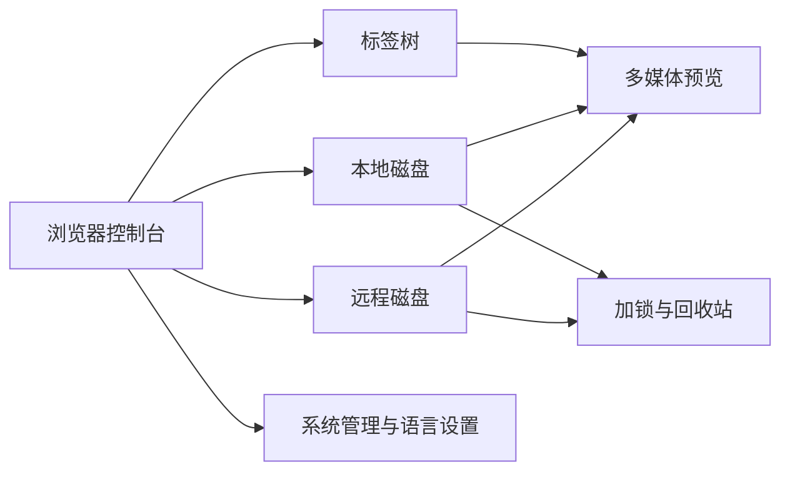
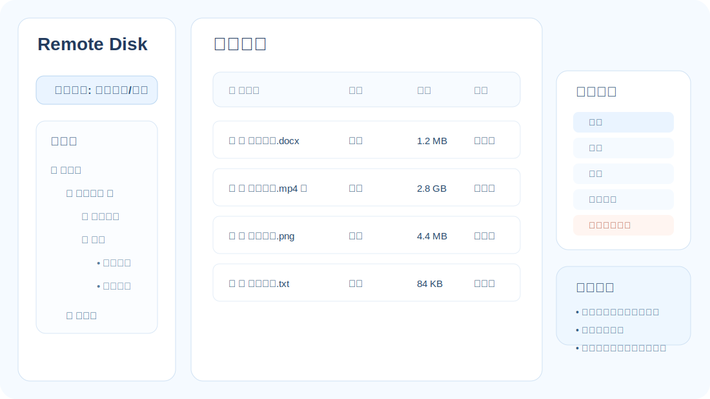
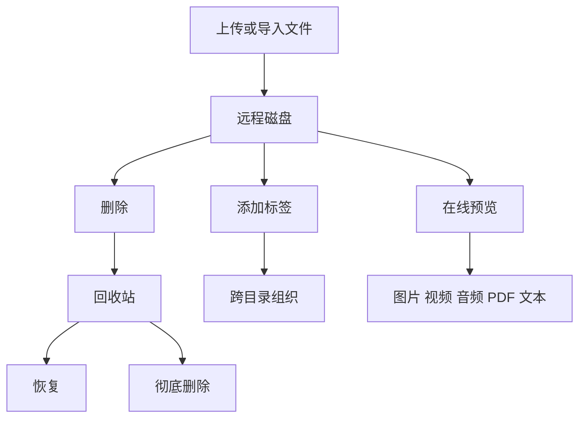
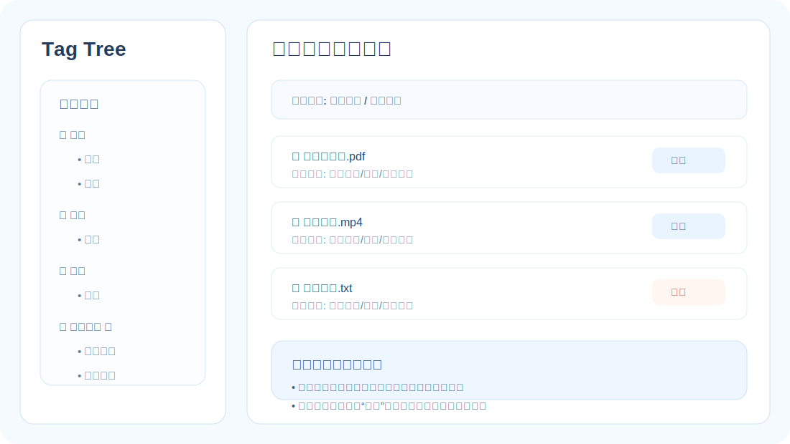
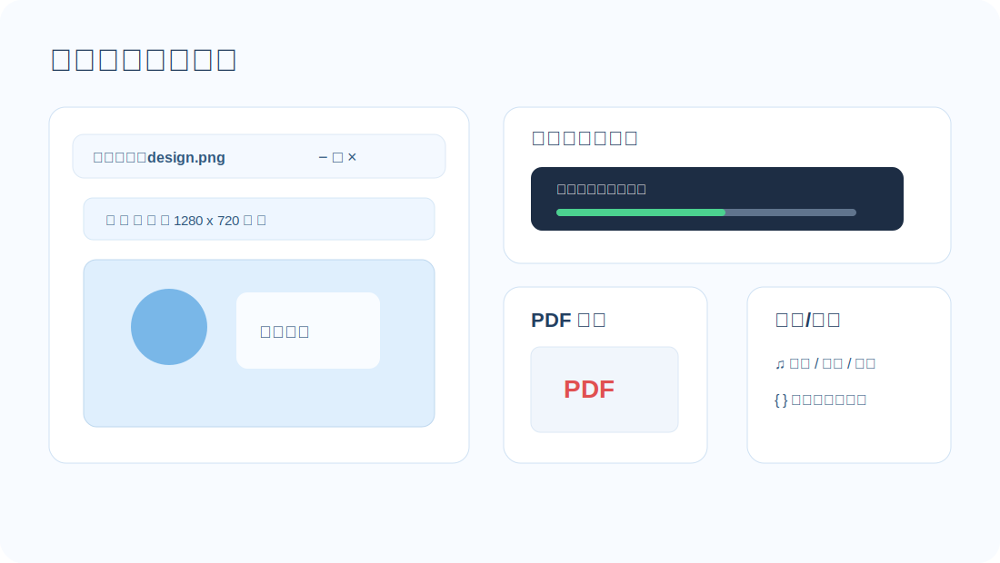
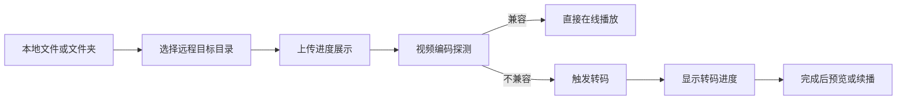
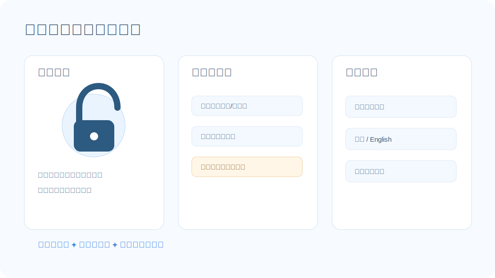

# webcool：一个面向个人与私有环境的全能文件管理控制台

webcool 已经不只是一个简单的文件上传和下载工具。它更像是一套运行在浏览器里的个人文件控制台：**既能管理远程存储空间，也能浏览服务器本机磁盘；既能处理普通文档，也能流畅预览图片、视频、音频、PDF 和文本；既支持标签化管理，也支持加锁保护、回收站、批量操作、续播、转码、图片编辑和系统管理。**

如果你希望在自己的机器、家庭服务器、工作站或私有云环境中搭建一个**轻量但功能完整**的文件管理系统，webcool 提供了一套非常实用的能力组合。


## 快速理解：webcool 能做什么

**可以把 webcool 理解成一个把“文件管理、媒体预览、安全保护、标签组织、系统配置”合并到同一浏览器控制台中的私有文件工作台。**

- **远程磁盘**：管理上传后的私有文件空间。
- **本地磁盘**：直接浏览服务器本机文件系统。
- **标签树**：让文件按主题而不是仅按目录组织。
- **多媒体预览**：图片、视频、音频、PDF、文本都可直接打开。
- **安全机制**：回收站、目录锁、文件锁、标签锁共同工作。
- **系统管理**：存储路径切换、语言设置、运行时配置统一收口。



上图展示了 webcool 的核心结构：**用户通过一个统一界面，同时操作远程文件、本地文件、标签关系和多媒体内容，而安全与系统配置能力贯穿整个流程。**

## 一、远程磁盘：像资源管理器一样管理私有文件空间

远程磁盘是 webcool 的核心文件管理区域。用户可以在浏览器中查看远程存储目录，创建目录、重命名目录、删除目录、恢复回收站内容，并对文件进行**预览、下载、删除、改名、加标签和加锁**等操作。



远程磁盘支持多级目录树。根目录和回收站作为固定入口展示，普通目录可以通过右键菜单执行新建子目录、删除、改名、加锁、解锁和去锁等操作。目录删除后不是直接消失，而是先进入回收站，从而降低误删风险。回收站中的文件和文件夹可以恢复，也可以彻底删除。

文件列表支持多种交互方式。**单击文件名表示选中，再次单击已选中文件会进入改名状态，双击才会执行下载。** 这种行为避免了过去误点文件名就直接下载的问题，也让文件改名更接近桌面文件管理器的体验。

每个文件还拥有右键菜单，提供摘要、下载、改名、删除或移除等入口。摘要窗口会展示文件名、文件大小、文件类型、创建时间和修改时间，方便快速了解文件信息。

## 二、本地磁盘：直接浏览服务器本机文件系统

webcool 不只管理远程上传目录，也支持浏览服务器本机磁盘。点击“本地磁盘”后，用户可以从当前用户目录、根目录、上一级目录等入口浏览本地文件系统，并可以选择是否显示隐藏文件。**这意味着它不仅是上传面板，也是服务器侧的文件浏览器。**


本地磁盘提供**列表模式和分栏模式**。列表模式适合快速查看当前目录下的所有文件和目录；分栏模式则提供目录树和右侧文件列表，适合在深层目录之间移动文件、查看内容和执行批量操作。

本地磁盘也支持按名称、类型、大小、修改时间排序。目录会显示目录图标，文件会根据扩展名显示可用操作，例如图片预览、视频观影、音频听音、文本查看、PDF 预览等。

本地磁盘的文件也支持单击选中、再次单击改名、双击下载。右键菜单支持摘要、下载、改名、移除、加锁、解锁、去锁；对于本地视频文件，还可以调用本地播放器播放。

本地目录同样支持右键操作，包括改名、删除、加锁、解锁和去锁。目录删除时会移动到系统回收站，而不是直接删除，减少误操作带来的损失。

## 三、回收站机制：删除前多一道保护

webcool 的删除策略强调安全性。**远程磁盘中的文件和文件夹删除后会进入 webcool 的回收站；本地磁盘中的文件和目录删除时会移动到系统回收站。**


在远程磁盘回收站里，用户可以恢复文件和文件夹，也可以彻底删除。对于文件夹，webcool 提供了专门的恢复入口，也支持选中后通过上方按钮执行恢复或彻底删除。

这种设计让 webcool 更适合长期存储和管理重要文件。**用户不必担心一次误点就造成无法挽回的结果。**



这张图体现了 webcool 中文件的安全生命周期：**文件进入远程磁盘后，可以被组织、预览、删除，但删除并不直接等于丢失，而是先进入可恢复阶段。**

## 四、标签树：跨目录组织文件

目录适合按位置组织文件，而标签适合按主题组织文件。webcool 提供了独立的标签树，支持视频、音频、图片等保留标签，也支持用户**自建标签和子标签**。



用户可以给远程磁盘文件和本地磁盘文件添加标签。文件列表中每个文件名前都有标签按钮，可以快速将单个文件加入标签；表头也提供批量加标签入口，方便一次性为多个文件建立关联。

标签视图中会列出该标签引用的文件。此时删除动作会变成“移除”，表示**只解除标签引用，不删除真实文件**。这一点避免了用户在标签视图下误删原始文件。

标签本身也支持加锁、解锁、去锁。除视频、音频、图片等保留标签外，自建标签可以独立保护，让用户对敏感分类进行访问控制。

## 五、加锁体系：目录、文件、标签都能保护

webcool 提供了比较完整的加锁机制。**远程磁盘目录、远程文件、本地文件、本地目录以及自建标签都可以加锁。**

目录锁具有继承特性：**父目录加锁后，其子目录和文件默认受到保护。** 但子目录也可以单独再加锁，且子目录锁优先级高于父级目录锁。目录解锁后，在当前会话中可以访问该目录及未单独加锁的子目录内容。

锁状态在界面上通过小锁图标展示。加锁状态显示闭合锁，当前会话解锁后显示打开锁。点击解锁状态的小锁可以重新加锁，不必再进入右键菜单。

解锁、去锁和加锁都使用美化后的弹窗，不再依赖浏览器原生 prompt。密码错误时会明确提示，避免用户不知道操作失败原因。

后端也会执行锁校验，**不能只依赖前端限制**。下载、列表、移动、改名、删除等关键操作都会检查锁状态，防止绕过前端直接访问接口。

## 六、多媒体预览：不下载也能看、听、读

webcool 支持丰富的在线预览能力：



- 图片：弹窗预览、上一张/下一张浏览、最大化、复原、关闭。
- 视频：浏览器内在线播放，支持上次播放位置续播。
- 音频：在线播放，支持顺序、随机、循环等播放模式。
- 文本：直接弹窗查看，适合代码、日志、配置文件等。
- PDF：使用浏览器内置 PDF 能力在弹窗中预览，最大化后可占满窗口空间。

图片预览尤其强大。用户可以左旋转、右旋转、剪切、等比例放大、等比例缩小，也可以手动输入宽高进行非等比例缩放。**编辑后的图片可以保存到服务端，也可以下载到本地。**

视频预览支持续播。**无论远程磁盘视频还是本地磁盘视频，都可以记录播放进度，下次打开时从上次位置继续播放。** 这对长视频、课程、电影和录播文件非常实用。

## 七、上传与转码：本地文件到远程磁盘的完整流程

webcool 支持普通上传，也支持从本地磁盘选择一个或多个文件、文件夹上传到远程磁盘。上传前会弹出远程目录树，让用户选择目标目录；上传过程中会显示**真实进度条和正在上传的文件列表**。

对于视频类文件，webcool 会在上传完成后探测音频编码是否适合浏览器播放。例如某些 MP4 文件的视频轨道可以播放，但音频是 AC3，浏览器无法直接播放声音。webcool 会检测这种情况，并提示用户是否需要转码。

如果需要转码，后端会将视频处理成浏览器更兼容的格式。**转码过程有进度提示，完成后会提供确认按钮关闭进度框。** 这样用户不用手动判断编码，也不用借助外部工具先处理文件。

在安装部署场景下，webcool 也支持把 ffmpeg 一并随安装包部署。安装包会把 ffmpeg 放到 `/opt/webcool/bin/ffmpeg`，启动器会优先把该路径注入运行环境，从而让视频探测与转码在未安装系统 ffmpeg 的机器上也能正常工作。

如果你希望使用自定义 ffmpeg，可在启动时通过命令行覆盖：

```bash
webcool -F /custom/path/ffmpeg -s 0.0.0.0:8080 -d ./uploads
```

未传 `-F` 时，webcool 会按“运行时参数 -> 环境变量 `AICOOL_FFMPEG` -> 安装路径/默认候选路径”的顺序自动选择可执行的 ffmpeg。



这条链路说明了 webcool 在上传后并不是简单“存进去就结束”，而是继续处理播放兼容性问题，从而把**上传、检测、转码、预览**连接成一个完整流程。

## 八、拖拽、批量选择与高效操作

webcool 支持多种高效操作方式。**它不是只能点按钮逐个处理文件，而是强调拖拽、多选、批量和分栏协作。**

在远程磁盘中，可以通过拖拽将普通文件夹移至回收站。按住 Shift 可以选择多个文件夹，并批量移至回收站；在回收站中也可以多选后批量恢复。

在本地磁盘分栏模式中，可以选择一个或多个文件或目录，通过拖拽移动到目标目录。为了支持多选移动，文件和目录前提供复选框。

本地磁盘和远程磁盘都支持批量移除、批量加标签、批量上传等操作。列表表头提供全选框，使大量文件处理更加顺手。

## 九、系统管理：存储路径与语言设置

webcool 提供系统管理模块。点击“系统管理”后，右侧分为功能命令栏和展示区。**文件管理之外的关键运行配置，也集中在这里完成。**



当前已经支持存储路径设置。用户可以查看当前远程磁盘的存储路径，也可以通过本地目录树选择新的存储目录。改变存储路径时，webcool 会提示是否迁移当前存储路径下的文件到目标目录。**如果用户选择“否”，则不会移动文件，也不会修改存储路径，** 以避免数据不一致或重复占用存储空间。

系统管理中还提供语言设置。目前 webcool 支持简体中文和英文。前端通过 i18n 机制加载不同语言资源，使界面可以面向不同语言环境使用。

## 十、启动参数补充

除了已有的监听地址、存储路径、线程和 sqlite 配置外，当前版本还支持下面两类运维常用参数：

- `-v`：仅输出版本号并退出。
- `-V`：输出详细信息并退出，包括版本号、平台、监听地址、存储路径、sqlite 路径、ffmpeg 路径等。
- `-F /path/to/ffmpeg`：指定 ffmpeg 可执行文件路径，覆盖自动探测结果。

例如：

```bash
webcool -V
webcool -F /opt/webcool/bin/ffmpeg -s 127.0.0.1:8080 -d ./uploads
```

## 十一、国际化与前端模块化

webcool 的前端已经进行了国际化整理。语言资源被抽离到 `html/i18n/zh.js` 和 `html/i18n/en.js`，主界面逻辑通过统一的翻译函数显示不同语言。

同时，原本庞大的 `main.js` 已拆分为多个功能模块，放在 `html/js/` 目录下。每个模块都可以单独做语法检查，主入口 `main.js` 负责按顺序加载模块并启动运行时。

这种结构让前端代码更易维护，也方便后续继续拆分成更彻底的 ES Module 或组件化结构。

## 十二、安全性与一致性设计

webcool 在很多操作上都考虑了安全边界：

- **删除优先进入回收站。**
- **加锁不仅限制前端，也由后端接口校验。**
- **本地磁盘移动目录时限制系统级目录，避免误操作破坏系统。**
- **存储路径修改必须确认迁移，否则不修改配置。**
- **文件改名、目录改名会同步更新标签、续播和锁信息，保证数据一致。**
- **本地磁盘删除目录也会进入系统回收站，而不是直接递归删除。**

这些设计让 webcool 更适合管理真实数据，而不是只做演示用途。

## 十三、适合哪些使用场景

webcool 很适合以下场景：

- **家庭媒体库**：管理电影、课程、音乐、图片和文档。
- **私有云文件中心**：在内网或个人服务器中管理文件。
- **开发者工作台**：浏览代码、日志、配置文件、PDF 文档。
- **多媒体资料库**：给视频、音频、图片打标签，跨目录分类。
- **本机文件控制台**：通过浏览器管理服务器上的本地磁盘文件。
- **安全文件柜**：通过目录锁、文件锁和标签锁保护敏感资料。

## 总结

webcool 的特点是“轻量但不简陋”。**它没有把自己限制成一个上传下载页面，而是逐步发展成了一个完整的文件管理、媒体预览、标签组织、安全保护和系统管理平台。**

远程磁盘让用户管理私有文件空间，本地磁盘让用户直接浏览服务器文件系统；标签树提供跨目录组织方式；回收站和加锁体系保障安全；图片编辑、视频续播、音频播放、PDF 预览和文本查看让文件内容可以直接在浏览器中使用；上传转码和系统管理则补齐了长期运行所需的能力。

对于希望拥有一个**可控、私有、功能丰富**的文件管理系统的用户来说，webcool 已经具备了非常强大的基础。
